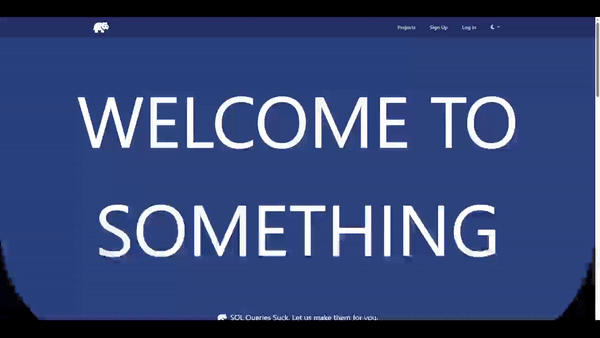

# Nothing

Welcome to nothing, a webbased application that allows users to visually interact with SQL databases to generate queries

### NOTE:

servers are no longer online, please reach out to me directly at https://kfan1.github.io/cv/ if you would like to use nothing.

## About

Nothing is a full stack web application hosted through github actions that helps users learn and interact with PostgreSQL databases. Through fully visual interactions, users can generate SQL queries to solidify and understand naming, insertion and selection syntax. Professionals can also use this tool to avoid the tedious memorization of SQL terms.

## Tutorial

Start by logging in or signing up.

Input database URI (currently only supporting PostgreSQL).

Add any table's you would like to visualize and generate queries for.
To generate a query, select on the exact pieces of data you are looking to query and click on generate query. Your selection query will be generated above this button.

For queries that require multiple tables, select all pieces of data from both tables you are looking to query. Make sure you select the join table (this join table does not need to be selected) or the table that includes the joining ID for many to one queries.

## Troubleshooting

If the queries are not loading, please check your table column names. Currently nothing is looking for a column 'id' or '\_id' to manage data. Customizable identification column names coming soon. Any other issues, feel free to post here, https://github.com/kfan1/Nothing/issues, and I will address it as soon as possible.

## Things to Do

- add environmental variables and remove database URI
- add options for id and unconventional or inconsistent naming schemes
- add documentation to the about tab
- potentially import all tables
- save past databases for accidental 'new database' clicks
